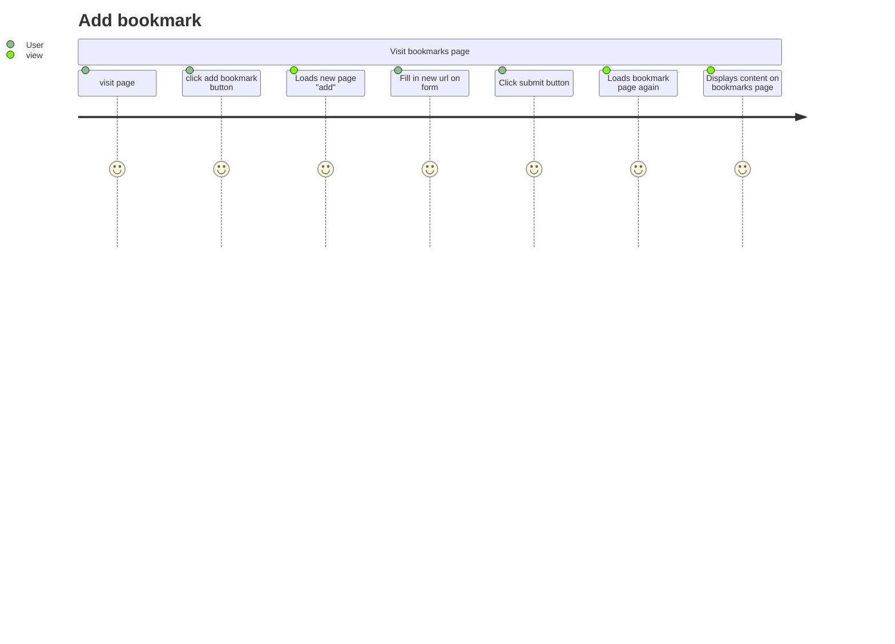

# bookmark_manager


This code is intended as a supplementary guide for [bookmark manager](https://github.com/makersacademy/course/tree/master/bookmark_manager). The commits on master branch roughly correspond with the walkthroughs provided in the challenge.

## User Stories

```
As a time-pressed user
So that I can quickly go to web sites I regularly visit
I would like to see a list of bookmarks

As a fan of the internet
So that I can remember all the sites I like
I would like to add bookmarks

```

## Domain Model




## Database setup


1. Connect to psql

2. Create the 'bookmark_manager' and 'bookmark_manager_test' databases:

```
CREATE DATABASE bookmark_manager;
CREATE DATABASE bookmark_manager_test;
```

3. To set up appropriate tables, connect to each database in 'psql' and run the SQL scripts in the 'db/migrations' folder in the given order.
